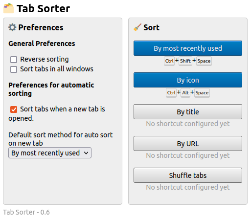
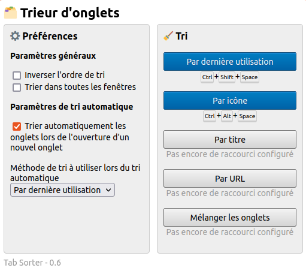

# Tab Sorter

Firefox extension to sort your tabs.

## Links

- [Create an Issue on GitHub](https://github.com/etienneschalk/tab-sorter-firefox/issues/new)
- [tab-sorter-firefox on GitHub](https://github.com/etienneschalk/tab-sorter-firefox)

## FAQ

### :question: How do I update the keyboard shortcuts mapping for the different sorting methods?

The extension comes with predefined shortcuts for some sorting methods. You can change them via Firefox directly. For more information see:

- :uk: [Manage extension shortcuts in Firefox](https://support.mozilla.org/en-US/kb/manage-extension-shortcuts-firefox)
- :fr: [Gérer les raccourcis d’extensions dans Firefox](https://support.mozilla.org/fr/kb/gerer-raccourcis-extensions-firefox)

## Changelog

### 2023-11-25

| :uk:                                              | :fr:                                              |
| ------------------------------------------------- | ------------------------------------------------- |
|  |  |

- Automated sorting on new tab
- Added commands so the user can define shortcuts
- General refactor of the code
- UI improvements

### 2023-05-14

- Persist extension settings (checkboxes)

## Development

### Help

- [Extension Workshop](https://extensionworkshop.com/)

- [Mozilla Docs - Your first WebExtension](https://developer.mozilla.org/en/docs/Mozilla/Add-ons/WebExtensions/Your_first_WebExtension)
- [Mozilla Docs - Working with the Tabs API](https://developer.mozilla.org/en-US/docs/Mozilla/Add-ons/WebExtensions/Working_with_the_Tabs_API)
- [Mozilla Docs - Anatomy of a WebExtension](https://developer.mozilla.org/fr/docs/Mozilla/Add-ons/WebExtensions/Anatomy_of_a_WebExtension#Background_scripts)
- [Mozilla Docs - Commands](https://developer.mozilla.org/fr/docs/Mozilla/Add-ons/WebExtensions/manifest.json/commands)
- [Mozilla Docs - Communication with background scripts](https://developer.mozilla.org/fr/docs/Mozilla/Add-ons/WebExtensions/Content_scripts#Communication_avec_les_scripts_darri%C3%A8re-plan)
- [Mozilla Docs - Implement a settings page](https://developer.mozilla.org/en-US/docs/Mozilla/Add-ons/WebExtensions/Implement_a_settings_page)

### Example of a Tab content

In Chromium:

````json
    {
        "active": false,
        "audible": false,
        "autoDiscardable": true,
        "discarded": false,
        "favIconUrl": "https://cdn.sstatic.net/Sites/stackoverflow/Img/favicon.ico?v=ec617d715196",
        "groupId": -1,
        "height": 939,
        "highlighted": false,
        "id": 1670254947,
        "incognito": false,
        "index": 2,
        "mutedInfo": {
            "muted": false
        },
        "pinned": false,
        "selected": false,
        "status": "complete",
        "title": "javascript - Chrome extension: Get last used tab - Stack Overflow",
        "url": "https://stackoverflow.com/questions/8688887/chrome-extension-get-last-used-tab",
        "width": 1876,
        "windowId": 1670254864
    }
```
### Legacy Todo list

_Disclaimer: these were written 4 years ago_

- Less naive filtering:
  - Better analyze of the URLs (exclude 'www.')
  - Taking into account the title for same domains (eg sorting youtube videos by title and not by id for better human readability)
- See better ways of sorting if possible (currently using sort())
- Filters:
  - v URL
  - v MRU
  - Domain
  - Title (used for domain and url for example)
- v Reverse
- Extraction by icon and connection with OneTab to reduce all tabs from a same domain
- Optimization:
  - Quick reverse if a first sort was just clicked
    (like a cache ; while no tab is moved after a sorting operation, if we choose the same operation but we reverse, we just reverse the tab without sorting all of them once again)
  - Quicker sort for MRU (comparison between numbers)
  - Put current group of tabs at the end / the beginning
  - Detect duplicate table
  - MRU is now implemented for Chrome 121+
  - Decouple firefox and chrome code
  - Better sorting of integer

### Performance

#### Looping on arrays

Firefox is on average very slower for looping than google chrome.
On Firefox, the faster loop for looping on an array seems to be forEach;
On Google Chrome, it seems to be the for loop.
````
